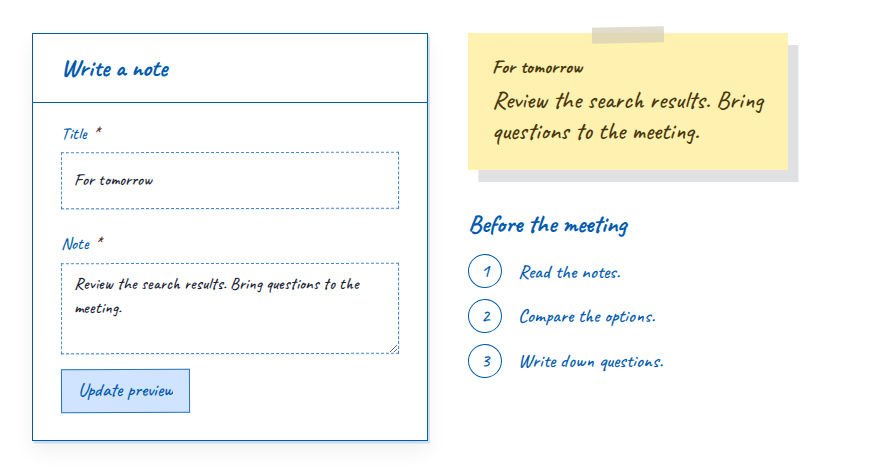

# Caderno UI

UI components inspired by handwritten notes on white paper. Blue ink, simple controls, and space for your content.

Built with web components. React and Astro have dedicated adapters; Vue and Svelte use the elements directly.

[](https://www.npmjs.com/package/@caderno-ui/elements)
[](https://github.com/andrewsrigom/caderno-ui/actions/workflows/ci.yml)
[](./LICENSE)

[Documentation](https://andrewsrigom.github.io/caderno-ui/) · [Components](https://andrewsrigom.github.io/caderno-ui/components/) · [Live example](https://andrewsrigom.github.io/caderno-ui/examples/preview/)

[](https://andrewsrigom.github.io/caderno-ui/examples/preview/)

## Install

The docs and demos include the upcoming 0.5 release. npm currently provides
0.4.1; see the [release status](https://github.com/andrewsrigom/caderno-ui/pull/3)
before using the new integration contracts.

For an existing Vite project, with Node.js 22.12 or newer:

```sh
npm install @caderno-ui/elements @caderno-ui/tokens @fontsource/caveat
```

## Add a note

Import the styles and component in your JavaScript entry file, such as `src/main.js`:

```js
import '@fontsource/caveat/latin-500.css'
import '@fontsource/caveat/latin-700.css'
import '@caderno-ui/tokens/notebook.css'
import '@caderno-ui/elements/fallback.css'
import '@caderno-ui/elements/note'
```

Then add the note to your HTML:

```html
<cad-note heading="For tomorrow"> Review the search results. </cad-note>
```

Caveat provides the handwritten lettering shown in the examples. The library defines font stacks; your application loads the fonts.

Import components individually to register only the ones you use. Charts require `@caderno-ui/elements/chart`; page animations use the optional `@caderno-ui/motion` package. Neither is required for the example above.

## Frameworks

Each guide covers installation, styles, events, slots, and limitations:

- [HTML](https://andrewsrigom.github.io/caderno-ui/integrations/html/)
- [React](https://andrewsrigom.github.io/caderno-ui/integrations/react/) and [Next.js](https://andrewsrigom.github.io/caderno-ui/integrations/next/)
- [Astro](https://andrewsrigom.github.io/caderno-ui/integrations/astro/)
- [Vue](https://andrewsrigom.github.io/caderno-ui/integrations/vue/) and [Svelte](https://andrewsrigom.github.io/caderno-ui/integrations/svelte/)

Try the React / Next.js [notes app](https://andrewsrigom.github.io/caderno-ui/examples/react/) or [Kanban board](https://andrewsrigom.github.io/caderno-ui/examples/react/kanban/). Both store data locally in your browser.

## Customization

The default theme is white. To use dark mode, add `data-theme="dark"` to `<html>`.

Change colors, fonts, and spacing with `--cad-*` CSS variables. Components expose CSS parts for more specific changes. See [theming](https://andrewsrigom.github.io/caderno-ui/theming/) and each component's API.

## Support

Packages are ESM-only. See the [support policy](./docs/support.md) for tested browser and framework versions, and current limitations.

During 0.x, minor releases may include breaking changes. Check the [migration guide](./docs/migration.md) before upgrading. Report bugs through [GitHub issues](https://github.com/andrewsrigom/caderno-ui/issues).

## Contributing

See [CONTRIBUTING.md](./CONTRIBUTING.md) for local setup, checks, and changesets. You do not need to clone this repository to use the library.

## License

[MIT](./LICENSE).
